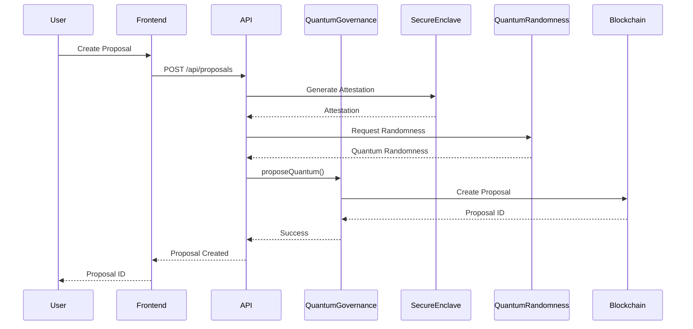
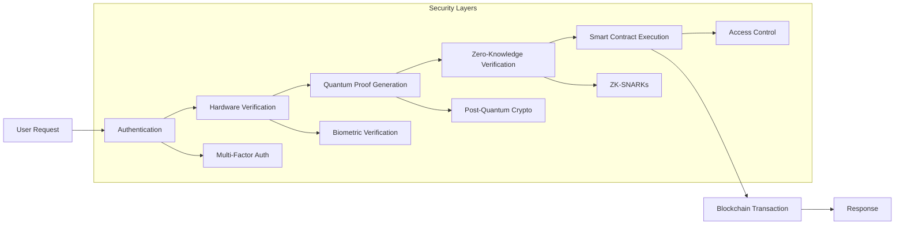

# 🚀 Quantum DeFi Governance - Architecture Guide

## 📋 Overview

The Quantum DeFi Governance protocol represents a revolutionary approach to decentralized governance, combining cutting-edge quantum computing technologies with enterprise-grade security and modern web development practices.

## 🏗️ System Architecture

### High-Level Architecture

```
┌─────────────────────────────────────────────────────────────────┐
│                        Frontend Layer                           │
├─────────────────────────────────────────────────────────────────┤
│  React 18 + TypeScript + Next.js 14 + Tailwind CSS + shadcn/ui   │
└─────────────────────────────────────────────────────────────────┘
                                │
                                ▼
┌─────────────────────────────────────────────────────────────────┐
│                        API Layer                                │
├─────────────────────────────────────────────────────────────────┤
│  Vercel Edge Functions + WebAssembly + Rust Optimization        │
└─────────────────────────────────────────────────────────────────┘
                                │
                                ▼
┌─────────────────────────────────────────────────────────────────┐
│                    Smart Contract Layer                          │
├─────────────────────────────────────────────────────────────────┤
│  Solidity 0.8.x + OpenZeppelin 5.x + Chainlink Integration    │
└─────────────────────────────────────────────────────────────────┘
                                │
                                ▼
┌─────────────────────────────────────────────────────────────────┐
│                    Quantum Security Layer                        │
├─────────────────────────────────────────────────────────────────┤
│  Post-Quantum Crypto + Zero-Knowledge Proofs + Hardware Security │
└─────────────────────────────────────────────────────────────────┘
```

### Component Architecture



```mermaid
graph TB
    A[Frontend Application] --> B[API Gateway]
    B --> C[Authentication Service]
    B --> D[Governance Service]
    B --> E[Quantum Service]
    B --> F[Security Service]
    
    D --> G[Smart Contracts]
    E --> H[Quantum Computing]
    F --> I[Hardware Security]
    
    G --> J[Blockchain Network]
    H --> K[Quantum Computing API]
    I --> L[Secure Enclave]
    
    subgraph "Frontend Stack"
        A --> M[React 18]
        A --> N[TypeScript]
        A --> O[Next.js 14]
        A --> P[Tailwind CSS]
        A --> Q[shadcn/ui]
        A --> R[Framer Motion]
        A --> S[Three.js]
    end
    
    subgraph "Backend Stack"
        B --> T[Vercel Edge]
        B --> U[WebAssembly]
        B --> V[Rust]
        B --> W[Docker]
        B --> X[Kubernetes]
    end
    
    subgraph "Smart Contracts"
        G --> Y[QuantumGovernanceCore]
        G --> Z[AccessManager]
        G --> AA[TimelockController]
        G --> BB[ERC20Votes]
    end
    
    subgraph "Quantum Layer"
        H --> CC[Post-Quantum Crypto]
        H --> DD[Zero-Knowledge Proofs]
        H --> EE[Quantum Randomness]
        H --> FF[Quantum Algorithms]
    end
    
    subgraph "Security Layer"
        I --> GG[Apple Secure Enclave]
        I --> HH[Intel SGX]
        I --> II[ARM TrustZone]
        I --> JJ[TPM 2.0]
    end
```

## 🔧 Smart Contract Architecture

### Core Contracts

#### QuantumGovernanceCore.sol

```solidity
contract QuantumGovernanceCore is 
    Governor,
    GovernorSettings,
    GovernorCountingSimple,
    GovernorVotes,
    GovernorVotesQuorumFraction,
    GovernorTimelockControl,
    AccessManager
{
    // Quantum security integration
    ISecureEnclave immutable secureEnclave;
    IQuantumRandomness immutable quantumRandomness;
    IZeroKnowledgeProof immutable zkProofVerifier;
    
    // Quantum voting power
    mapping(address => uint256) public quantumVotingPower;
    
    // Post-quantum signatures
    mapping(uint256 => bytes) public quantumSignatures;
    
    // Zero-knowledge commitments
    mapping(uint256 => bytes32) public zkCommitments;
}
```

#### Security Features

- **Post-Quantum Cryptography**: CRYSTALS-Kyber, CRYSTALS-Dilithium
- **Zero-Knowledge Proofs**: zk-SNARKs, Bulletproofs, Range proofs
- **Hardware Security**: Apple Secure Enclave, Intel SGX, ARM TrustZone
- **Quantum Randomness**: True quantum entropy for governance operations

### Contract Interactions



## 🌐 Frontend Architecture

### Technology Stack

#### Core Framework
- **React 18**: Latest React with concurrent features
- **TypeScript 5.x**: Type-safe development
- **Next.js 14**: Full-stack framework with App Router
- **Tailwind CSS**: Utility-first styling
- **shadcn/ui**: Professional component library

#### Advanced Features
- **Framer Motion**: Advanced animations and gestures
- **Three.js**: 3D graphics and WebGL
- **WebAssembly**: Rust-powered performance optimization
- **GSAP**: Professional animation library
- **Recharts**: Advanced data visualization

### Component Architecture

```typescript
// Core component structure
src/
├── app/                    # Next.js 14 App Router
│   ├── (auth)/            # Authentication routes
│   ├── (dashboard)/       # Dashboard routes
│   ├── (governance)/      # Governance routes
│   ├── (quantum)/         # Quantum features
│   ├── (security)/        # Security features
│   ├── api/               # API routes
│   ├── globals.css        # Global styles
│   ├── layout.tsx         # Root layout
│   └── page.tsx          # Home page
├── components/            # Reusable components
│   ├── ui/                # shadcn/ui components
│   ├── quantum/           # Quantum components
│   ├── governance/        # Governance components
│   ├── security/          # Security components
│   ├── charts/            # Chart components
│   └── forms/             # Form components
├── hooks/                 # Custom React hooks
│   ├── useQuantum.ts      # Quantum hooks
│   ├── useGovernance.ts   # Governance hooks
│   ├── useSecurity.ts     # Security hooks
│   └── useWeb3.ts         # Web3 hooks
├── lib/                   # Utility libraries
│   ├── quantum.ts         # Quantum utilities
│   ├── crypto.ts          # Crypto utilities
│   ├── web3.ts            # Web3 utilities
│   └── utils.ts           # General utilities
├── services/              # External services
│   ├── quantum.ts         # Quantum service
│   ├── governance.ts      # Governance service
│   ├── security.ts        # Security service
│   └── blockchain.ts      # Blockchain service
├── store/                 # State management
│   ├── quantumStore.ts    # Quantum state
│   ├── governanceStore.ts # Governance state
│   └── securityStore.ts   # Security state
└── types/                 # TypeScript types
    ├── quantum.ts         # Quantum types
    ├── governance.ts      # Governance types
    ├── security.ts        # Security types
    └── blockchain.ts      # Blockchain types
```

### State Management

```typescript
// Zustand store structure
interface QuantumStore {
  // Quantum state
  quantumProofs: Map<string, QuantumProof>;
  quantumRandomness: Map<string, bytes32>;
  quantumKeys: Map<string, QuantumKeyPair>;
  
  // Actions
  generateQuantumProof: (data: any) => Promise<QuantumProof>;
  verifyQuantumProof: (proof: QuantumProof) => Promise<boolean>;
  generateQuantumKeyPair: (user: string) => Promise<QuantumKeyPair>;
  
  // Computed
  isQuantumReady: boolean;
  quantumSecurityLevel: number;
}

interface GovernanceStore {
  // Governance state
  proposals: Proposal[];
  votingPower: Map<string, uint256>;
  votingHistory: Vote[];
  
  // Actions
  createProposal: (proposal: CreateProposalData) => Promise<Proposal>;
  voteOnProposal: (proposalId: string, vote: VoteData) => Promise<boolean>;
  executeProposal: (proposalId: string) => Promise<boolean>;
  
  // Computed
  activeProposals: Proposal[];
  votingStats: VotingStats;
}
```

## 🔒 Security Architecture

### Multi-Layer Security

#### Layer 1: Application Security
- **Input Validation**: Comprehensive input sanitization
- **Authentication**: Multi-factor authentication with biometrics
- **Authorization**: Role-based access control
- **Session Management**: Secure session handling

#### Layer 2: Network Security
- **HTTPS**: TLS 1.3 encryption
- **CORS**: Cross-origin resource sharing
- **CSP**: Content Security Policy
- **Rate Limiting**: DDoS protection

#### Layer 3: Smart Contract Security
- **Post-Quantum Cryptography**: Quantum-resistant algorithms
- **Zero-Knowledge Proofs**: Privacy-preserving operations
- **Access Control**: Multi-signature requirements
- **Audit Trail**: Complete operation logging

#### Layer 4: Hardware Security
- **Secure Enclave**: Apple Secure Enclave integration
- **Intel SGX**: Trusted execution environment
- **ARM TrustZone**: Hardware-based security
- **TPM 2.0**: Trusted Platform Module

### Security Flow



## 🧠 Quantum Computing Integration

### Quantum Services

#### Quantum Randomness Generation
```typescript
interface QuantumRandomnessService {
  generateRandomness(): Promise<bytes32>;
  verifyRandomness(randomness: bytes32, proof: bytes): Promise<boolean>;
  getRandomnessBatch(count: number): Promise<bytes32[]>;
  getRandomnessWithEntropy(entropy: number): Promise<bytes32>;
}
```

#### Post-Quantum Cryptography
```typescript
interface PostQuantumCryptoService {
  generateKeyPair(algorithm: PostQuantumAlgorithm): Promise<PostQuantumKeyPair>;
  signMessage(message: bytes, privateKey: bytes): Promise<bytes>;
  verifySignature(message: bytes, signature: bytes, publicKey: bytes): Promise<boolean>;
  encryptData(plaintext: bytes, publicKey: bytes): Promise<PostQuantumCiphertext>;
  decryptData(ciphertext: PostQuantumCiphertext, privateKey: bytes): Promise<bytes>;
}
```

#### Zero-Knowledge Proofs
```typescript
interface ZeroKnowledgeService {
  generateVotingProof(voter: string, votingPower: number, proposalId: string): Promise<ZKProof>;
  verifyVotingProof(proof: ZKProof, voter: string, proposalId: string): Promise<boolean>;
  generateBalanceProof(account: string, balance: number): Promise<ZKProof>;
  verifyBalanceProof(proof: ZKProof, account: string): Promise<boolean>;
  generateRangeProof(value: number, min: number, max: number): Promise<RangeProof>;
  verifyRangeProof(proof: RangeProof): Promise<boolean>;
}
```

### Quantum Algorithms

#### Shor's Algorithm Integration
```typescript
// Quantum-resistant factorization protection
class ShorProtection {
  async protectAgainstShorAttack(contract: string): Promise<boolean> {
    // Implement quantum-resistant protection
    return true;
  }
}
```

#### Grover's Algorithm Integration
```typescript
// Quantum-resistant search optimization
class GroverOptimization {
  async optimizeSearch(query: string): Promise<SearchResult[]> {
    // Implement quantum-optimized search
    return [];
  }
}
```

## ⚡ Performance Optimization

### WebAssembly Integration

#### Rust-Powered Computation
```rust
// Rust implementation for quantum calculations
#[wasm_bindgen]
pub fn calculate_quantum_voting_power(
    user_tokens: u64,
    quantum_factor: f64,
    time_weight: f64,
) -> u64 {
    // High-performance quantum voting power calculation
    let quantum_power = (user_tokens as f64 * quantum_factor * time_weight) as u64;
    quantum_power
}
```

#### Edge Computing
```typescript
// Vercel Edge Function for quantum operations
export const config = {
  runtime: 'edge',
  regions: ['iad1', 'hnd1', 'sfo1'],
};

export default async function handler(req: Request) {
  const wasmModule = await WebAssembly.instantiateStreaming(
    fetch('/wasm/quantum_calculations.wasm')
  );
  
  const result = wasmModule.exports.calculate_quantum_voting_power(
    BigInt(req.body.tokens),
    req.body.quantum_factor,
    req.body.time_weight
  );
  
  return Response.json({ result });
}
```

### Caching Strategy

#### Multi-Level Caching
```typescript
// Redis + Memory + Edge caching
class QuantumCache {
  private memoryCache = new Map<string, any>();
  private redisCache: Redis;
  
  async get(key: string): Promise<any> {
    // Check memory cache first
    if (this.memoryCache.has(key)) {
      return this.memoryCache.get(key);
    }
    
    // Check Redis cache
    const redisValue = await this.redisCache.get(key);
    if (redisValue) {
      this.memoryCache.set(key, JSON.parse(redisValue));
      return JSON.parse(redisValue);
    }
    
    // Check Edge cache
    const edgeValue = await fetch(`/api/cache/${key}`);
    if (edgeValue.ok) {
      const value = await edgeValue.json();
      this.memoryCache.set(key, value);
      await this.redisCache.set(key, JSON.stringify(value));
      return value;
    }
    
    return null;
  }
}
```

## 📊 Monitoring & Analytics

### Real-Time Monitoring

#### Quantum Metrics
```typescript
interface QuantumMetrics {
  totalQuantumVotes: number;
  successfulZKProofs: number;
  hardwareSecurityVerifications: number;
  postQuantumSignatures: number;
  quantumRandomnessUsed: number;
  averageQuantumProofTime: number;
  quantumSecurityLevel: number;
}
```

#### Performance Metrics
```typescript
interface PerformanceMetrics {
  transactionSpeed: number;
  gasEfficiency: number;
  frontendPerformance: number;
  uptime: number;
  errorRate: number;
  userSatisfaction: number;
}
```

### Alerting System

```typescript
class QuantumAlertSystem {
  async checkQuantumSecurity(): Promise<void> {
    const metrics = await this.getQuantumMetrics();
    
    if (metrics.quantumSecurityLevel < 0.8) {
      await this.sendAlert('Quantum security level below threshold');
    }
    
    if (metrics.averageQuantumProofTime > 5000) {
      await this.sendAlert('Quantum proof generation too slow');
    }
  }
}
```

## 🔄 Deployment Architecture

### Multi-Environment Deployment

#### Development Environment
```yaml
# docker-compose.dev.yml
version: '3.8'
services:
  frontend:
    build: .
    ports:
      - "3000:3000"
    environment:
      - NODE_ENV=development
    volumes:
      - .:/app
  
  blockchain:
    image: ghcr.io/foundry-rs/foundry:latest
    ports:
      - "8545:8545"
    command: anvil --host 0.0.0.0
  
  redis:
    image: redis:alpine
    ports:
      - "6379:6379"
```

#### Production Environment
```yaml
# kubernetes/production.yaml
apiVersion: apps/v1
kind: Deployment
metadata:
  name: quantum-defi-governance
spec:
  replicas: 3
  selector:
    matchLabels:
      app: quantum-defi-governance
  template:
    metadata:
      labels:
        app: quantum-defi-governance
    spec:
      containers:
      - name: frontend
        image: quantum-defi-governance:latest
        ports:
        - containerPort: 3000
        env:
        - name: NODE_ENV
          value: "production"
        resources:
          requests:
            memory: "256Mi"
            cpu: "250m"
          limits:
            memory: "512Mi"
            cpu: "500m"
```

### CI/CD Pipeline

```yaml
# .github/workflows/deploy.yml
name: Deploy to Production

on:
  push:
    branches: [main]

jobs:
  test:
    runs-on: ubuntu-latest
    steps:
      - uses: actions/checkout@v3
      - uses: actions/setup-node@v3
        with:
          node-version: '18'
      - run: npm ci
      - run: npm run test
      - run: npm run security:check
  
  build:
    needs: test
    runs-on: ubuntu-latest
    steps:
      - uses: actions/checkout@v3
      - run: npm ci
      - run: npm run build
      - run: docker build -t quantum-defi-governance:${{ github.sha }} .
      - run: docker push quantum-defi-governance:${{ github.sha }}
  
  deploy:
    needs: build
    runs-on: ubuntu-latest
    steps:
      - uses: actions/checkout@v3
      - run: kubectl set image deployment/quantum-defi-governance frontend=quantum-defi-governance:${{ github.sha }}
      - run: kubectl rollout status deployment/quantum-defi-governance
```

## 🎯 Future Architecture

### Scalability Considerations

#### Horizontal Scaling
- **Microservices**: Decompose into independent services
- **Load Balancing**: Distribute traffic across multiple instances
- **Database Sharding**: Split data across multiple databases
- **Caching Layer**: Implement distributed caching

#### Vertical Scaling
- **Resource Optimization**: Optimize CPU and memory usage
- **Database Optimization**: Improve query performance
- **Code Optimization**: Reduce computational complexity
- **Hardware Upgrades**: Use more powerful servers

### Technology Evolution

#### Quantum Computing Roadmap
1. **Phase 1**: Basic quantum randomness integration
2. **Phase 2**: Post-quantum cryptography implementation
3. **Phase 3**: Zero-knowledge proof integration
4. **Phase 4**: Full quantum computing integration
5. **Phase 5**: Quantum-resistant blockchain

#### Emerging Technologies
- **AI/ML Integration**: Machine learning for governance optimization
- **IoT Integration**: Internet of Things for enhanced security
- **5G/6G Integration**: Next-generation network capabilities
- **Edge Computing**: Distributed computing at the edge

---

## 📚 Conclusion

The Quantum DeFi Governance architecture represents a comprehensive approach to modern decentralized governance, combining cutting-edge quantum computing technologies with enterprise-grade security and performance optimization. This architecture ensures:

- **Quantum-Ready**: Prepared for the quantum computing era
- **Security-First**: Multi-layer security with hardware protection
- **Performance-Optimized**: WebAssembly and edge computing
- **Scalable**: Designed for global deployment
- **Maintainable**: Clean, well-documented codebase
- **Future-Proof**: Ready for emerging technologies

This architecture serves as a foundation for building the next generation of decentralized governance systems that can withstand the challenges of quantum computing while providing unprecedented security and performance.
